# TomoAid GTM｜Q2 Goals & Key Activities

> **Period:** 2026 Q2（April — June）
> **Prepared by:** TomoAid Team
> **關聯文件：** [TomoAid GTM Master Playbook](./TomoAid_GTM_Plan.md)

---

## 流程總覽

```mermaid
flowchart LR
    subgraph G1["① 品牌建設基礎"]
        A1["品牌核對清單"]
        A2["官網產品頁"]
        A3["內容渠道建立"]
    end

    subgraph G2["② GTM 定位完成"]
        B1["TomoLand 定位文件"]
        B2["TomoHire 定位文件"]
        B3["SaaaS 定位文件"]
    end

    subgraph G3["③ Launch 交付物"]
        C1["TomoLand\nSales Deck + Demo"]
        C2["TomoHire\nLanding Page + Demo"]
        C3["SaaaS\nAPI 文件 + 開發者頁"]
    end

    subgraph G4["④ AI 內容自動化系統"]
        D1["GTM 主題庫\n+ Prompt Template"]
        D2["Claude API\n內容生成腳本"]
        D3["串接排程工具\n定期自動生成"]
    end

    subgraph G5["⑤ 品牌曝光渠道執行"]
        E1["LinkedIn 內容發布"]
        E2["合作夥伴接洽"]
        E3["Blog 發布 + 成效回顧"]
    end

    DONE(["✅ Q2 完成"])

    G1 --> G2
    G2 --> G3
    G3 --> G5
    G3 -.->|"並行"| G4
    G4 --> G5
    G5 --> DONE
```



---

## Q2 Goals & Key Activities

### Goal 1：完成 TomoAid 品牌建設基礎
> 對應 GTM Playbook：Phase 0 — Branding

| # | Key Activity | 期間 | Status |
|---|--------------|------|--------|
| 1.1 | 完成品牌核對清單（VI 色系規範、Tone of Voice、品牌故事） | 4/13–17 | Todo |
| 1.2 | 官網新增三個產品功能說明頁（TomoLand / TomoHire / SaaaS） | 4/20–24 | Todo |
| 1.3 | 建立官網 Blog 架構 + LinkedIn 內容策略文件 | 4/27–5/1 ⚠️ 5/1 勞動節放假 | Todo |

---

### Goal 2：完成三個產品 GTM 定位
> 對應 GTM Playbook：Phase 1–3（分級 / 分類矩陣 / 五問法）

| # | Key Activity | 期間 | Status |
|---|--------------|------|--------|
| 2.1 | 完成 TomoLand 產品定位文件（含競品分析、Battlecard） | 5/4–8 | Todo |
| 2.2 | 完成 TomoHire 產品定位文件（含競品分析、Battlecard） | 5/11–15 | Todo |
| 2.3 | 完成 SaaaS 產品定位文件（含競品分析、Battlecard） | 5/18–22 | Todo |

---

### Goal 3：完成各產品 Launch 交付物
> 對應 GTM Playbook：Phase 4 — Launch Checklist

| # | Key Activity | 期間 | Status |
|---|--------------|------|--------|
| 3.1 | TomoLand：Sales Deck + 產品 Demo 影片 + 定價表 | 5/25–29 | Todo |
| 3.2 | TomoHire：Landing Page + 產品 Demo 影片 + Onboarding 文件 | 6/1–5 | Todo |
| 3.3 | SaaaS：API 文件 + Quick Start 教學 + 開發者頁面 | 6/8–12 | Todo |

---

### Goal 4：建立 AI 內容自動化系統
> 對應 GTM Playbook：Phase 0 — AI 內容自動化工作流
> ⚡ 與 Goal 3 並行執行

| # | Key Activity | 期間 | Status |
|---|--------------|------|--------|
| 4.1 | 整理 GTM 主題庫（JSON）+ 建立 Prompt Template | 5/25–29 | Todo |
| 4.2 | 建立 Claude API 內容生成腳本（Level 1：半自動） | 6/1–5 | Todo |
| 4.3 | 串接排程工具，實現每週自動生成草稿（Level 2） | 6/8–12 | Todo |

---

### Goal 5：啟動品牌曝光渠道執行
> 對應 GTM Playbook：Phase 0 — 品牌曝光渠道規劃（執行階段）
> 🤖 透過 Goal 4 建立的 AI 系統產出內容

| # | Key Activity | 期間 | Status |
|---|--------------|------|--------|
| 5.1 | LinkedIn 發布前 4 篇知識型內容（透過 AI 系統產出） | 6/15–19 ⚠️ 6/19 放假 | Todo |
| 5.2 | 接洽 1–2 個合作夥伴（產業協會 / KOL / 異業） | 6/22–26 | Todo |
| 5.3 | 官網 Blog 發布 2 篇文章 + Q2 成效回顧 | 6/29–30 | Todo |

---

## GitHub 管理方式

```
GitHub Repository（建議放於 tomoaid/tomoaid-web 或獨立 gtm repo）
├── Milestones
│   ├── Goal 1：品牌建設基礎（Due: 5/1）
│   ├── Goal 2：GTM 定位完成（Due: 5/22）
│   ├── Goal 3：Launch 交付物（Due: 6/12）
│   └── Goal 4：品牌曝光起步（Due: 6/30）
├── Issues（每個 Key Activity 建一個 Issue）
│   ├── label: activity  → Key Activities
│   ├── label: blocker   → 阻塞項目
│   └── label: meeting-notes → 週會紀錄
└── Project Board（Kanban）
    ├── Todo
    ├── In Progress
    └── Done
```

### 建議 Labels

| Label | 用途 |
|-------|------|
| `goal-1` `goal-2` `goal-3` `goal-4` `goal-5` | 對應各 Goal |
| `tomoland` `tomohire` `saas` | 對應各產品 |
| `activity` | Key Activity |
| `blocker` | 阻塞項目 |
| `meeting-notes` | 週會紀錄 |

---

## Regular Weekly Meeting — GTM Weekly Sync

### 基本資訊

| 項目 | 內容 |
|------|------|
| 頻率 | 每週五 |
| 時長 | 30–45 分鐘 |
| 參與者 | TomoAid 全員 |
| 記錄方式 | 會議紀錄以 GitHub Issue 存檔，tag `meeting-notes` |

### 固定議程

1. **上週進度 Update**（各 Goal 狀態，5 分鐘）
2. **本週目標確認**（對齊優先項目，10 分鐘）
3. **Blockers / Issues 討論**（10 分鐘）
4. **Action Items 分配**（明確 owner + deadline，10 分鐘）

### 會議紀錄 Issue 範本

```markdown
## GTM Weekly Sync — YYYY/MM/DD

### 上週進度
- [ ] Goal 1：...
- [ ] Goal 2：...
- [ ] Goal 3：...
- [ ] Goal 4：...

### 本週目標
- [ ] ...

### Blockers
- ...

### Action Items
| Action | Owner | Due |
|--------|-------|-----|
| ...    | ...   | ... |
```

---

*Last updated: 2026-04-15*
